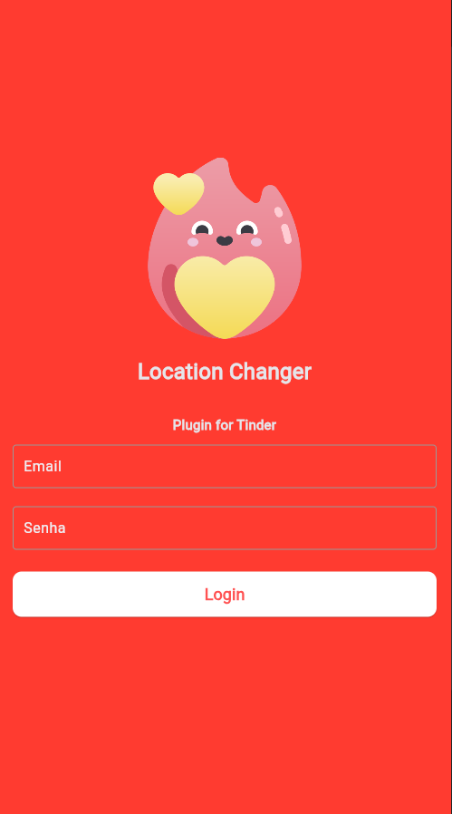
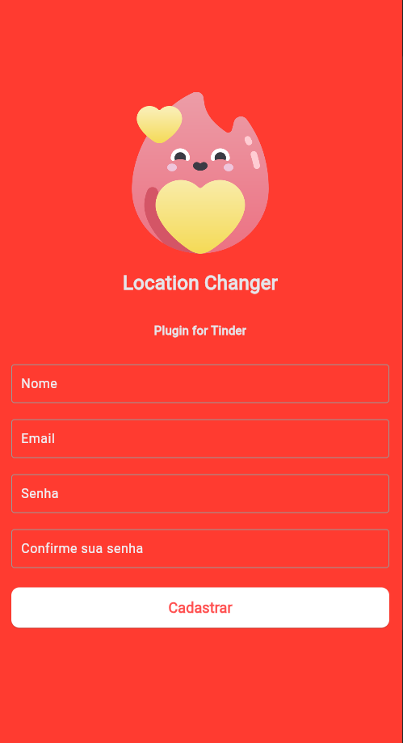

# Location Changer

Este é o projeto de resolução do desafio de um curso gratuito de Flutter. O objetivo deste desafio é implementar uma tela de login simples com campos de entrada, botões e imagens da web.

## Funcionalidades

- Tela de login com campos para email e senha.
- Tela de cadastro para novos usuários.
- Interface com elementos modernos, como `TextField` e `ElevatedButton`.
- Exibição de imagem na parte superior da tela.
- Personalização da cor da borda do campo de texto.
- Configuração da cor do texto digitado.

## Screenshots

Aqui estão algumas capturas de tela da aplicação:

### Tela de Login


### Tela de Cadastro


## Como usar

### Pré-requisitos

- [Flutter](https://flutter.dev/docs/get-started/install) instalado no seu sistema.
- [Android Studio](https://developer.android.com/studio) ou [VS Code](https://code.visualstudio.com/) com o plugin Flutter configurado.

### Passos para rodar o projeto

1. Clone este repositório:
   ```bash
   git clone https://github.com/seu-usuario/location-changer.git
   ```

2. Navegue até a pasta do projeto:
   ```bash
   cd location-changer
   ```

3. Instale as dependências:
   ```bash
   flutter pub get
   ```

4. Execute o projeto:
   ```bash
   flutter run
   ```